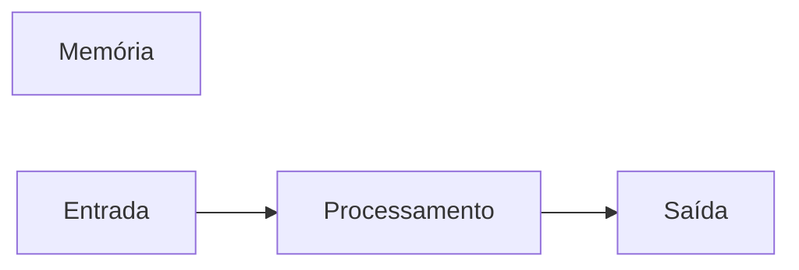

# JavaScript
Repositório usado para estudo da lógica de programção com uso da linguagem de javaScript. 
## Autor 
Diego Cavalcanti 

---
## Variáveis
Variáveis são espaços na memória do computador usados para guardar valores que podem alterar ao longo do programa.
### Pincipais tipos primitivos: 
- strings (texto)
- number (numeros interios e não inteiros)
- boolean (verdadeiro ou falso)

## Operadores Aritiméticos
| Operador | Propósito | Exemplo | Resultado |
|----------|-----------|---------|-----------|
| = | Atribuir um valor | x = 10 | x = 10 | 
|+ | Somar | 10 + 5 | 15 | 
| += | Somar e atribuir | x += 5 | x = 15 |
| - | Subtrair | 15 - 10 | 5 |
| -= | Subtarir e atribuir | x -= 10 | x = 5 | 
| * | Multiplicação | 5 * 4 | 20 | 
| *= | Multiplicar e astribuir | x *= 4 | x = 20 |
| / | Dividir | 20 / 2 | 10 |
| /= | Dividir e atribuir | x /= 2 | 10 |
| ++ | Somar 1 ao resultado | x++ | 11 | 
| -- | Subtrair 1 do resultado | x-- | 10 | 
| % | Resto da divisão | 10 % 3 | 1 | 

## Operadores Lógicos 
| Operador | Simbologia |
|------------|-------------|
| ANO | && |
| OR | \|\| | 
| NOT | ! | 

## Comparadores
| Comparador | Significado |
|------------|-------------|
|     >      | Maior que |
| >= | Maior ou igual a |
| < | Menor que |
| <= | Menor ou igual a |
| === | Idêntico a | 
| !== | Não idêntico a | 

---
## Estruturas de controle 
### Estruturas de controle condicionais 

```javaScript
if (condição){
  //condição verdadeira
}

if (condição) {
  //condição verdadeira
} else {
  //condição falsa
}

if (condição 1) {
  // condição 1 verdadeira
} else if (condição 2) {
  // condição 2 verdadeira
} else {
  // se nehuma das condições anteriores for verdadeira
}

switch (valor) {
  case 1:
    \\código caso o valor seja 1
    break
case 2:
    \\código caso o valor seja 2
    break
default:
  \\código caso o valor seja diferente de 1 ou 2
  break
}
```
